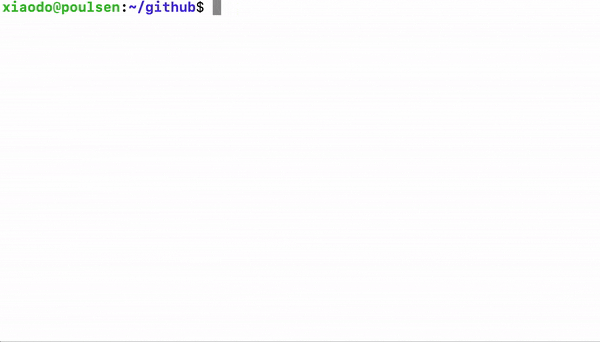

<div align="center">
<h1>The Tu Programming Language</h1>

[文档手册:筹备中](tu-lang.cn) 

</div>
<div align="center">
<p>
<!---->


    
</p>


</div>

tu-lang(凸）是一种编程语言，旨在创造一种非常简单的零依赖、支持动态&&静态语法的编译型语言,全静态链接，目前已自举完成: `compiler纯动态语法，asmer纯静态语法，linker动静混合语法`.
```
tu  [options] file.tu        
    build *.tu              编译成汇编后进行链接生成二进制可执行文件
    -s  *.tu|dir            编译为tulang代码为linux-amd64汇编文件
    -c  *.s |dir            编译汇编为elf&pecoff跨平台可重定向cpu指令集文件
    -o  *.o |dir            链接elf&pecofff可重定向文件生成最终执行程序
    -d                      开启trace日志打印编译详细过程
    -gcc                    支持通过gcc链接生成最终可执行程序
    -g                      编译tu文件时带上debug段信息,支持栈回溯
    -std                    编译runtime&std相关内置库代码
```
## demo

  
## env & install
`linux`: 环境安装
```asciidoc
$ git clone https://github.com/tu-lang/tu.git
$ cd tu
$ sudo make install
```
## compiler&asmer&linker测试
更多语法测试用例在`/tests`目录下，包含了各种数据结构、运算、gc、demo测试
- 单元测试
```
$ cd tu
$ sudo make install
$ make tests
```

## @数据结构
- [x] 动态类型 int float string bool null array map closure object
- [x] 原生类型 pointer i8 u8 i16 u16 i32 u32 i64 i64 f32 f64 struct
- [x] func,goto,class,mem
- [x] return,type,use,if,continue,break
- [x] while,for|range for,loop
- [x] match

### @动态写法
更多用例请看`/tests`
```
use fmt
class Http {
    request
}
Http::closure(){
    return fn(){
        return ["arr1","arr2",3,4]
    }
}
fn factory(){
    a = ["1",2,"some string word"]     // array
    b = {1:2,"sdfds":3,"a":a}          // map
    return a,b
}
fn main(){
    a = "this is a string"             // string
    b,c = 1000,200.33                  // number
    fmt.println(a,b,c)

    a,b = factory()
    fmt.print(a[0],a[1],a[2])
    fmt.print(b["a"],b["sdfds"])

    obj = new Http()                    // object
    obj.request = {"method":"POST"}
    cfunc = obj.closure()               // member
    fmt.println(cfunc())
}
```
```
use fmt
use os
fn main(){
    map = { "1":'a' , "hello":"world" , 3:5.11 , "arr": [ 0,1,2,3,4] }
    for k,v : map {
        if k == "arr" {
            for v2 : v {}
        }
        fmt.println(k,v)
    }

    match map["hello"] {
        map    : os.die("not this one!")
        999    : os.die("not this one!")
        "hello" | "world": {
            fmt.println("got it",map["hello"])
        }
        _      : {
            os.die("not default")
        }
    }
}
```
### @静态写法
更多用例请看`/tests`
```
use runtime
Null<i64> = 0
enum {
    Insert,
    Update
    Conflict,
}

mem Rbtree {
    RbtreeNode* root
    RbtreeNode* sentinel
	u64         insert
}
mem RbtreeNode {
    u64  key
    u8   color
    RbtreeNode* left
    RbtreeNode* right
    RbtreeNode* parent

    runtime.Value* k
    runtime.Value* v[Conflict]
}
Rbtree::find(hk<u64>){

    node<RbtreeNode>     = this.root
    sentinel<RbtreeNode> = this.sentinel

    while node != sentinel 
    {
        if  hk != node.key  {
            if  hk < node.key {
                node = node.left
            }else{
                node = node.right
            }
            continue
        }
    }
    return Null
}
fn main(){}
```
## License
Copyright @2016-2024 The tu-lang author. All rights reserved.
