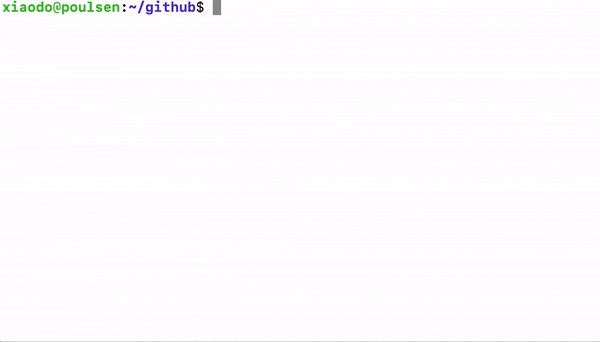

<div align="center">
<h1>The Tu Programming Language</h1>

[文档手册 · 筹备中](https://tu-lang.cn)

<p>


</p>


**零依赖 · 动静同构 · 全静态链接 · 已自举**

`compiler` 纯动态 · `asmer` 纯静态 · `linker` 动静混合 —— 整条工具链用 Tu 自己写成。

</div>

---

Tu（凸）是一门面向系统与应用的编译型语言：没有强制 runtime 绑架，动态语法写起来像脚本，静态 `mem` / 原生类型又能落到可预测的机器码。一份源码里两种气质可以并肩出现。

```
tu  [options] file.tu
    build *.tu              编译 → 汇编 → 链接 → 可执行文件
    -s  *.tu|dir            编译为 linux-amd64 汇编
    -c  *.s |dir            汇编 → ELF / PE-COFF 可重定位目标
    -o  *.o |dir            链接生成最终程序
    -d                      trace：打印详细编译过程
    -gcc                    经 gcc 链接
    -g                      带 debug 段，支持栈回溯
    -std                    编译 runtime & std 内置库
```

## Demo



## Install

```bash
git clone https://github.com/tu-lang/tu.git
cd tu
sudo make install
```

## Tests

语法与运行时用例都在 `tests/`（数据结构、运算符、GC、async、asyncio 集成等）。

```bash
sudo make install
make tests
```

## Language surface

| 层 | 能力 |
|----|------|
| 动态 | `int` `float` `string` `bool` `null` `array` `map` `closure` `object` |
| 静态 | `i8`…`u64` `f32` `f64` `pointer` `mem` |
| 控制与模块 | `func`/`fn` `goto` `class` `return` `type` `use` `if` `while` `for`/`range` `loop` `match` |
| 现代抽象 | `async`/`await` · `api`/`impl` |

---

### Dynamic — 异构数据一把梭

Map、数组、闭包、对象可以塞进同一条流水线；`match` 直接吃表达式，不需要先拆成一堆 if。

```
use fmt
use os

class Hub {
    routes
}
Hub::handler(){
    return fn(path){
        return {
            "path": path,
            "ok":   true,
            "tags": ["api", "v1", path]
        }
    }
}

fn bootstrap(){
    table = {
        "GET /":     "index",
        "POST /run": [200, "accepted"],
        "meta":      { "lang": "tu", "zero_dep": true }
    }
    hub = new Hub()
    return table, hub.handler()
}

fn main(){
    routes, handle = bootstrap()
    fmt.println(routes["meta"])

    hit = handle("/run")
    match hit["path"] {
        "/run" | "/exec" : fmt.println("dispatch", hit["tags"])
        _                : os.die("unknown route")
    }
}
```

---

### Static — 结构体就是布局

`mem` + 原生整数/指针：红黑树节点这种东西可以直接按字段布局写，没有「先装箱再猜」。

```
use runtime

Null<i64> = 0
enum {
    Insert,
    Update,
    Conflict,
}

mem Rbtree {
    RbtreeNode* root
    RbtreeNode* sentinel
    u64         insert
}
mem RbtreeNode {
    u64  key
    u8   color
    RbtreeNode* left
    RbtreeNode* right
    RbtreeNode* parent
    runtime.Value* k
    runtime.Value* v[Conflict]
}

Rbtree::find(hk<u64>){
    node<RbtreeNode>     = this.root
    sentinel<RbtreeNode> = this.sentinel
    while node != sentinel {
        if hk != node.key {
            if hk < node.key {
                node = node.left
            } else {
                node = node.right
            }
            continue
        }
        break
    }
    if node == sentinel return Null
    return node
}

fn main(){}
```

---

### Async — 无栈协程，工厂直接 `.await`

叶子 future 用 `mem … : async` + `poll`；调用侧可以 `factory().await`，不必先塞进中间变量。

```
use fmt
use runtime
use os

mem ReadStream: async {
    i32 bytes
    i32 readn
    i32 fd
}
ReadStream::poll(ctx){
    if this.readn != this.bytes {
        this.readn += 1
        return runtime.PollPending
    }
    match this.fd {
        1 : return runtime.PollReady, "hello "
        2 : return runtime.PollReady, "world"
        _ : os.die("")
    }
}

fn open_stream(fd<i32>) ReadStream {
    return new ReadStream { fd: fd, bytes: 5, readn: 0 }
}

async read(){
    buf = ""
    buf += open_stream(1).await
    buf += open_stream(2).await
    return buf
}

fn main(){
    body = runtime.block(read())
    fmt.println(body)   // hello world
}
```

---

### Api + Impl — 静态类型上的多态

接口带默认方法，`impl` 只补差异；同一个 `Animal` 槽可以先后挂 `Cat` / `Dog`。

```
use fmt

api Animal {
    fn name()
    fn talk()
    fn do(){
        fmt.printf("%s can %s\n", this.name(), this.talk())
    }
}

mem Dog {}
impl Animal for Dog {
    fn name(){ return "dog" }
    fn talk(){ return "wowo!" }
}

mem Cat {}
impl Animal for Cat {
    fn name(){ return "cat" }
    fn talk(){ return "miao!" }
}

fn main(){
    ani<Animal> = new Cat{}
    ani.do()        // cat can miao!
    ani = new Dog{}
    ani.do()        // dog can wowo!
}
```

## License

Copyright © 2016–2026 The tu-lang authors. All rights reserved.
